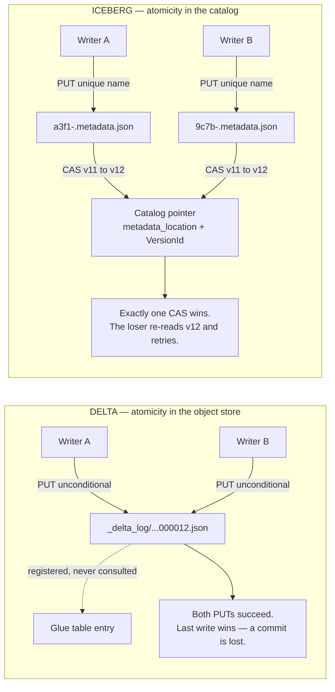
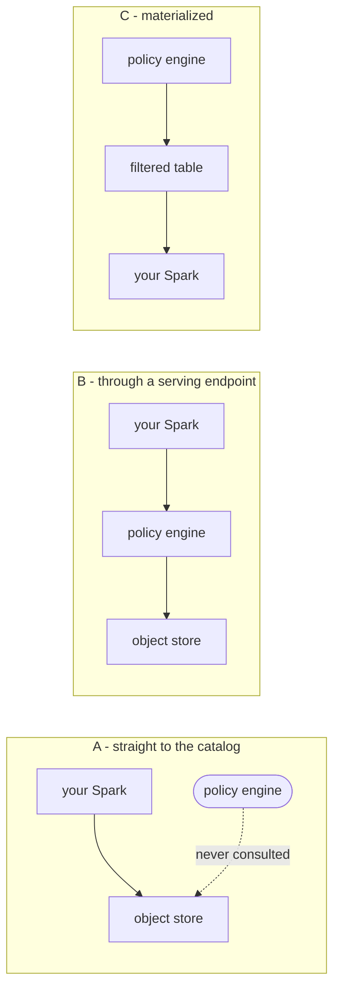

# What a Catalog Owes You

Thirteen dimensions that separate a technical catalog from a table listing, each with a test you can run — plus what Lake Formation actually adds to AWS Glue, how Snowflake Horizon behaves over different kinds of table, and which catalogs serve Delta and Iceberg equally.

> **Reading time** ~50 min end to end · ~10 min for the short path: [§2 the dimensions](#2-what-a-modern-technical-catalog-owes-you) → [§9 consolidated scores](#9-consolidated-scores) → [§10 lock-in](#10-what-this-implies-for-the-lock-in-question).
>
> **Reviewed against** Delta 4.1–4.3, Unity Catalog OSS 0.4, Apache Polaris 1.x, AWS Glue and Snowflake as of September 2026.

---

## Scope

**This evaluates the technical catalog: who arbitrates writes, and who governs reads.** It deliberately excludes the semantic and AI layer — metric and semantic views, natural-language query, agent context and retrieval, and the assistant features Databricks and Snowflake sell alongside their catalogs. Those are a different product category with different competitors, they move fast enough to date any comparison within months, and scoring them here would favour the two integrated platforms for reasons unrelated to the question these notes exist to answer.

Two things that exclusion does *not* mean:

1. **The layers are coupled at one seam that is already in scope.** Whatever semantic layer you adopt later will read column descriptions, tags, constraints, lineage and query history *out of the catalog* — so a catalog that captures none of those, or captures them unexportably, is a worse foundation for any choice you make above it. That is D7 and D9, scored below.
2. **This is a snapshot, not a permanent boundary.** Semantic views and metric views are being moved into these catalogs as first-class objects, which will make them a D9 question before long — and those definitions will prove exactly as unportable as row filters. Same D12 problem, new asset type, and it tends to become load-bearing before anyone decides it should be.

---

## Contents

1. [Namespaces, and the words near them](#1-namespaces-and-the-words-near-them)
2. [What a modern technical catalog owes you](#2-what-a-modern-technical-catalog-owes-you)
3. [The thirteen dimensions, concretely](#3-the-thirteen-dimensions-concretely)
4. [The dialect problem, in detail](#4-the-dialect-problem-in-detail)
5. [Glue natively vs. Glue with Lake Formation](#5-glue-natively-vs-glue-with-lake-formation)
6. [Glue vs. Unity Catalog vs. Horizon](#6-glue-vs-unity-catalog-vs-horizon)
7. [Polaris, scored — self-hosted and Snowflake-hosted](#7-polaris-scored--self-hosted-and-snowflake-hosted)
8. [Defining "supports both formats well"](#8-defining-supports-both-formats-well)
9. [Consolidated scores](#9-consolidated-scores)
10. [What this implies for the lock-in question](#10-what-this-implies-for-the-lock-in-question)

---

## 1. Namespaces, and the words near them

The rubric leans on "namespace" throughout, and it is the term used most loosely in this space. Two minutes here saves a lot of talking past each other later.

> ### Namespace
> **An ordered sequence of identifier levels that scopes a table name.**
>
> `finance › orders` in Glue · `prod › finance › orders` in Unity Catalog

That is all it is. What makes it consequential is that three separate things hang off it — and a catalog that is short of namespace levels is short on all three at once.

| | What it does | What goes wrong without it |
|---|---|---|
| **Job 1 · Collision domain** | Two teams both want a table called `orders`. The namespace decides whether they can have one each. | Run out of levels and people encode the missing one into the name — `finance_prod_orders` — which no tool can reason about and no grant can match on. |
| **Job 2 · Grant inheritance** | Permissions attach to a namespace and flow down to the tables inside it, including tables that do not exist yet. | `GRANT SELECT ON SCHEMA finance TO analysts` should cover tomorrow's tables. Where a namespace is only a name prefix, every grant is per-table and the set drifts from day one. |
| **Job 3 · Mount point** | A free level at the top where an *entire foreign catalog* can be attached without renaming anything inside it. | Exactly the filesystem sense of the word. Worked through below — it is the least obvious of the three and the one that decides whether a migration can be incremental. |

### Depth is not cosmetic

```
Glue / Hive                         Unity Catalog / Snowflake
  finance  ›  orders                  prod  ›  finance  ›  orders
  └ database  └ table                 │        └ schema   └ table
                                      └ catalog ── the mount point
  No level is free. Mounting
  another catalog means renaming      legacy ›  finance  ›  orders
  every database first.               └ the same Glue tables, federated
                                        in, renaming nothing

Iceberg REST — any depth the deployment wants:
  GET /v1/namespaces/finance%1Feu%1Fpii/tables
  levels joined by the 0x1F unit separator
```

Depth costs nothing until you need it, and cannot be added afterwards without renaming everything below it — which is why it is worth checking before it is the thing blocking a migration.

### The mount point, worked through

The filesystem analogy is not a metaphor — it is the same mechanism. Mounting a second disk at `/mnt/old` brings its whole directory tree in, intact, under a name you chose. If your filesystem had no nesting — just a flat list of top-level directories — attaching that disk would mean renaming every directory on it to avoid clashing with yours. Catalog namespaces work identically, and a catalog with no spare level is that flat filesystem.

Make it concrete. You have 400 tables across 12 Glue databases, and roughly 900 dbt models, Airflow DAGs and BI extracts that reference them by name. You want to move to an open catalog over two quarters, incrementally.

**Target catalog has no spare level.** The foreign catalog's databases are peers of your own. Two options, both bad.

```
(a) same names — now two systems both claim to own this:
      finance.orders

    which one answers depends on which catalog the ENGINE is configured
    against. So the cutover is per-engine and all-or-nothing: no table can
    be half-migrated, and two teams on different engines silently read
    different data.

(b) prefix to disambiguate:
      glue_finance.orders

    every one of the 900 references is now wrong. You fix them all — and
    when the migration completes and the prefix goes away, you fix them all
    again. Two renames per reference to move a table once.
```

**Target catalog has a spare level.**

```sql
-- attach the whole Glue catalog, renaming nothing inside it, copying no data
CREATE CONNECTION glue_prod TYPE glue OPTIONS (...);
CREATE FOREIGN CATALOG legacy USING CONNECTION glue_prod;

-- both trees now resolve in one engine, one session, one query
SELECT o.id, c.segment
FROM   legacy.finance.orders  o        -- still in Glue
JOIN   prod.crm.customers     c        -- already migrated
  ON   c.id = o.cust_id;

-- migrating one table is one rename, and only its own references change.
-- The other 399 keep working.
     legacy.finance.orders  ->  prod.finance.orders

-- and teams that have not migrated can set their default catalog to
-- `legacy`, so their unqualified `finance.orders` keeps resolving exactly
-- as it did. Zero changes for them until their tables actually move.
```

That is the whole of it: **the spare level is what lets old and new coexist under one name resolution, so migration becomes a per-table decision instead of a per-engine cutover.** Without it, "incremental migration" is not a strategy that is available to you, regardless of how much you would prefer it.

The same free level does two other jobs you will want later, for the same reason — it holds a whole tree that is not yours:

- **Environments.** `dev.finance.orders` and `prod.finance.orders`, rather than `finance_dev` and `finance_prod` — which forces every grant and every automation to string-match on suffixes.
- **Other people's data.** A partner's shared catalog, or another business unit's, attaches as a top-level name instead of being flattened into yours.

Glue has retrofitted a catalog tier above databases, along with federated catalogs, so the level formally exists. The practical caveat is that a great deal of tooling around Glue still assumes `database.table` and will not carry the third part — so check that your engines, your dbt profiles and your BI connectors actually address it before planning around it.

### Three words people say when they mean something adjacent

| Word | What it means | Where the confusion comes from |
|---|---|---|
| **Catalog** | The *service* — the thing that resolves names, decides who may read, and (if it is doing its job) decides what version a table is at. | In three-level systems it is also the name of the top namespace level. "Catalog" can mean the product or one level inside it. |
| **Schema** | Either the column list and types of one table, or a namespace level as in `catalog.schema.table`. This note says "table schema" for the first and "namespace" for the second. | Databricks, Snowflake and ANSI SQL use the second sense; Hive and Glue call the same level a *database*. |
| **Warehouse** | The storage root a catalog writes new tables under — `s3://lake/warehouse`. A property of the catalog, not of any namespace. | Unrelated to "warehouse" meaning a query engine, which is the more common usage everywhere else. |

---

## 2. What a modern technical catalog owes you

"Catalog" covers two jobs that used to be separate and are now expected in one product: the *transaction authority* (who decides what the current version of a table is) and the *governance plane* (who may see what, and what happened). Glue does the first well for Iceberg and the second only through Lake Formation. Thirteen dimensions, scored 0–3, are enough to make the comparison concrete.

| | Dimension | What it measures |
|---|---|---|
| **D1** | Identity & namespace | Stable table UUIDs that survive rename; multi-level namespaces; a single logical name that engines resolve identically. |
| **D2** | Commit authority | The catalog is the serialization point for writes — not a mirror updated after the fact. Assessed per table format. |
| **D3** | Multi-table transactions | Two tables committed atomically. Only possible when the catalog owns commit ordering for both. |
| **D4** | Open API surface | Iceberg REST Catalog spec, Delta commit APIs. The measure of whether an engine you have not chosen yet can join. |
| **D5** | Credential vending | Short-lived, path-scoped storage credentials issued per request, so engines never hold raw bucket policies. |
| **D6** | Fine-grained authorization | Row filters, column masks, tag/attribute-based policy, inherited down the namespace — and unbypassable. |
| **D7** | Lineage & audit | Column-level lineage captured automatically; a queryable access log, not just cloud-provider API trails. |
| **D8** | Portable views & functions | A view defined once that Trino, Spark and Snowflake all resolve — the hardest interop problem after commits. |
| **D9** | Non-table assets | Files/volumes, ML models, functions under the same grants. Determines whether the catalog governs the platform or one slice. |
| **D10** | Lifecycle services | Compaction, clustering, snapshot expiry, orphan-file cleanup driven by the catalog rather than by your cron. |
| **D11** | Federation | Mounting foreign catalogs — HMS, Glue, JDBC, another warehouse — under one namespace without copying data. |
| **D12** | Exit path | Open spec, OSS implementation, and an export of the governance model. Directly proportional to your leverage. |
| **D13** | Compute reach | Which engines can execute against the catalog, running where — and whether the catalog quietly requires a vendor-operated service on the query path. |

---

## 3. The thirteen dimensions, concretely

Each dimension carries a **test** — a question you can put to a candidate catalog and get a yes or a no, rather than a marketing answer. The code is what the yes and the no actually look like.

### D1 · Identity & namespace

Two separable things: the *namespace* — the levels that scope a name, as defined in §1 — and the *identity* a name resolves to. Hive-derived catalogs collapse them, making the string pair `(database, table)` *be* the identity. Modern catalogs mint a UUID at create time and let the human-readable name move independently, so grants, lineage and downstream references follow a rename instead of breaking on it.

> **The test** — Rename a table. Do its grants, lineage edges and audit history survive?

```jsonc
// Iceberg REST — identity is a UUID
GET /v1/namespaces/finance/tables/orders
{
  "metadata-location": "s3://lake/finance/orders/metadata/00042-a3f1b9.metadata.json",
  "metadata": {
    "table-uuid": "9f2b1c44-8e07-4a11-...",   // the name is a label; the uuid is the table
    "current-snapshot-id": 7264913882031,
    "format-version": 2
  }
}
```

```python
# Glue — identity IS the name. There is no stable object id.
glue.get_table(DatabaseName="finance", Name="orders")

# a "rename" is two unrelated calls:
glue.create_table(DatabaseName="finance", TableInput={"Name": "orders_v2", ...})
glue.delete_table(DatabaseName="finance", Name="orders")

# -> a new object. Lake Formation grants on finance.orders do not follow.
#    Neither does anything that referenced it.
```

### D2 · Commit authority

Whether the catalog is the serialization point for writes, or a mirror updated afterwards. The single dimension that most cleanly separates "catalog" from "table list" — and the one where the answer differs completely between Iceberg and Delta.

> **The test** — Take the catalog offline. Can a writer still advance the table to a new version? If yes, it is not the authority.

**Why the answer differs by format.** Iceberg puts its atomicity in the catalog; classic Delta puts its atomicity in the object store's filename space.

A Delta table's current version is not recorded anywhere. It is *derived* — a reader lists `_delta_log/` and takes the highest contiguous version number. That design is what makes Delta catalog-free and portable, and it is also what makes the filename the only serialization point. Two writers that both read version 11 will both compute "my commit is 12," both render a file named `...000012.json`, and both try to create it. Correctness requires that exactly one of those creates succeeds — which is precisely `putIfAbsent`. HDFS gave it (atomic rename), ADLS Gen2 gave it, GCS gave it. S3, until conditional writes shipped in November 2024, did not: `PUT` was unconditional and last-writer-wins. Hence `S3SingleDriverLogStore` (correct only when every writer shares one JVM), `S3DynamoDBLogStore` (borrow DynamoDB's conditional write as an external mutual-exclusion service), and the custom commit coordinators many teams built.

Iceberg sidesteps the problem by construction. Every metadata file is written under a name containing a fresh UUID, so no two writers ever contend for a name. The table's identity is a *single pointer* — "this table's current metadata is at *path*" — and that pointer lives in the catalog. Committing means asking the catalog to swap the pointer from the value you read to the value you produced, conditionally.



```python
# Iceberg on Glue — the CAS, as the client actually performs it
t   = glue.get_table(DatabaseName="finance", Name="orders")["Table"]
cur = t["Parameters"]["metadata_location"]
ver = t["VersionId"]                       # version token read with the pointer

# write new metadata to a UUID-derived name — no contention possible
new_loc = f"{base}/metadata/00043-{uuid4()}.metadata.json"
s3.put_object(Bucket=..., Key=..., Body=serialize(new_metadata))

# compare-and-swap. This single call IS Iceberg's concurrency control.
glue.update_table(
    DatabaseName="finance",
    TableInput={"Name": "orders", "Parameters": {
        "metadata_location":          new_loc,
        "previous_metadata_location": cur}},
    VersionId=ver)
# a concurrent writer bumped VersionId -> ConcurrentModificationException
#   -> refresh from v12, re-apply, retry
```

```properties
# Delta, filesystem-managed — note that Glue appears nowhere in the configuration
spark.delta.logStore.s3a.impl                            io.delta.storage.S3DynamoDBLogStore
spark.io.delta.storage.S3DynamoDBLogStore.ddb.tableName  delta_log_mutex
spark.io.delta.storage.S3DynamoDBLogStore.ddb.region     us-east-1

# The mutual exclusion is DynamoDB's conditional write, not Glue's.
# Glue holds a location and a schema copy that nothing verifies.
```

**Delta 4.1+ changes this.** Catalog-managed tables give the Delta protocol a commit-coordinator seat it previously did not have:

```sql
ALTER TABLE finance.orders
  SET TBLPROPERTIES ('delta.feature.catalogManaged' = 'supported');

-- commit path becomes:
--   1. PUT _delta_log/_staged_commits/<uuid>.json   (unconditional, safe —
--      the name is UUID-derived, so nobody can contend for it)
--   2. POST commit v12 to the catalog                (catalog decides ordering,
--      validates server-side, rejects conflicts before they are visible)
--   3. backfill ...000012.json asynchronously        (for legacy readers)
```

The trade is real and worth naming: a filesystem-managed Delta table is readable by anything that can list a prefix; a catalog-managed one is not. You have made the catalog a hard runtime dependency of every read and write — the same bargain Iceberg made in 2017.

### D3 · Multi-table transactions

Only reachable once the catalog owns commit ordering for every table involved — which is why it is the clearest downstream payoff of D2, and why no filesystem-coordinated format can offer it.

> **The test** — Can a reader observe table A updated and table B not, in the middle of a pipeline step?

```sql
-- with a commit-owning catalog
BEGIN;
  INSERT INTO silver.orders SELECT * FROM bronze.orders_raw WHERE dt = '2026-09-08';
  MERGE INTO gold.order_summary t USING silver.orders s ON t.k = s.k
    WHEN MATCHED THEN UPDATE SET ...;
COMMIT;
-- both version bumps ratified together, or neither. No window.

-- Iceberg REST spec endpoint:  POST /v1/{prefix}/transactions/commit
```

```
Without one — the observable anomaly

09:14:02  silver.orders       -> v88   OK
09:14:39  gold.order_summary  -> v41   job OOMs

For 37 seconds any reader sees new orders with stale summaries. After the
crash, that state is permanent until someone notices. Detection and repair
are your code.
```

### D4 · Open API surface

Not "does it have an API" but "is the API a specification someone else has also implemented." That is the difference between a catalog you can leave and a catalog you can only migrate off.

> **The test** — Change one configuration line to point the same job at a different vendor's catalog. Does it run unmodified?

```properties
spark.sql.catalog.lake            org.apache.iceberg.spark.SparkCatalog
spark.sql.catalog.lake.type       rest
spark.sql.catalog.lake.warehouse  s3://lake/warehouse

spark.sql.catalog.lake.uri        https://glue.us-east-1.amazonaws.com/iceberg
#                                 https://polaris.internal/api/catalog
#                                 https://lakekeeper.internal/catalog
# only this line and the auth scheme change. Every query above it is untouched.
```

```bash
curl -H "Authorization: Bearer $TOKEN" https://$CATALOG/v1/config
curl -H "Authorization: Bearer $TOKEN" https://$CATALOG/v1/namespaces/finance/tables
```

Watch for the re-coupling: Glue's Iceberg REST **extension** endpoint adds server-side scan planning that is not in the spec. Useful, and using it puts you back on an AWS-only path.

### D5 · Credential vending

The catalog issues short-lived, path-scoped storage credentials per request. Without it, every engine node needs standing IAM permission on the warehouse prefix — which quietly demotes every table-level grant to advisory.

> **The test** — Does a Trino worker need an instance role with `s3:GetObject` on the warehouse prefix? If yes, there is no vending.

```http
GET /v1/namespaces/finance/tables/orders
X-Iceberg-Access-Delegation: vended-credentials
```
```jsonc
{ "metadata-location": "...",
  "config": {
    "s3.access-key-id":     "ASIA...",
    "s3.secret-access-key": "...",
    "s3.session-token":     "...",
    "s3.region":            "us-east-1",
    "expires-at-ms": "1757352000000"      // ~1h, scoped to this table's prefix
  } }
```

Versus the alternative — `"Resource": "arn:aws:s3:::lake/warehouse/*"` on the engine's instance role, i.e. anyone who can submit a job to that cluster can read every table in the warehouse, whatever the catalog's grants say.

### D6 · Fine-grained authorization

Row filters, column masks and attribute-based policy, inherited down the namespace. The dimension that matters is not whether the features exist but whether they can be bypassed — which makes D6 largely a function of D5.

> **The test** — Can a user get the unfiltered table by reading the files directly?

```sql
CREATE FUNCTION finance.region_guard(region STRING)
  RETURN is_account_group_member('finance-admin')
      OR region = session_user_region();

ALTER TABLE  finance.orders    SET ROW FILTER finance.region_guard ON (region);
ALTER TABLE  finance.customers ALTER COLUMN ssn SET MASK finance.mask_last4;
GRANT SELECT ON TABLE finance.orders TO `analysts`;
```

```python
# the bypass probe — run this as an analyst
spark.read.format("delta").load("s3://lake/finance/orders").show()

# credential-vending catalog  -> 403; no credentials are issued for a direct
#                                path read, so the filter holds
# IAM-granted bucket access   -> the full, unfiltered table, ssn in clear
```

Lake Formation does implement row filters and column grants — but enforcement lives in LF-integrated engines. A plain EMR job with S3 permissions reads around them. The features are real; the boundary is not.

### D7 · Lineage & audit

Automatically captured column-level derivation, plus a queryable access log. Cloud API trails are not a substitute: they record who called `GetTable`, not who read which column or where a value came from.

> **The test** — A number in a dashboard is wrong. Can you name every upstream column that fed it, without asking a human?

```sql
SELECT source_table_full_name, source_column_name, target_column_name, event_time
FROM   system.access.column_lineage
WHERE  target_table_full_name = 'gold.revenue'
  AND  target_column_name     = 'net_arr';

SELECT user_identity.email, action_name, request_params.full_name_arg
FROM   system.access.audit
WHERE  service_name = 'unityCatalog' AND event_date >= current_date() - 7;
```

```jsonc
// what CloudTrail gives you instead
{ "eventSource": "glue.amazonaws.com",
  "eventName":   "GetTable",
  "userIdentity": { "arn": ".../emr-instance-role" },   // a shared role, not a person
  "requestParameters": { "databaseName": "finance", "name": "orders" } }
// the object is a table, not a column. There is no derivation graph at all.
```

### D8 · Portable views & functions

A view defined once that several engines resolve identically. After commit coordination this is the hardest interoperability problem, because a view is SQL text and SQL dialects disagree — sometimes loudly, and sometimes by silently returning different numbers. [§4](#4-the-dialect-problem-in-detail) works this through in detail.

> **The test** — Define a view in Spark. Does Trino return the same rows — or any rows?

```jsonc
// Iceberg view spec — dialects are explicit
"representations": [
  { "type": "sql", "dialect": "spark",
    "sql": "SELECT id, date_trunc('MONTH', ts) AS m FROM finance.orders" },
  { "type": "sql", "dialect": "trino",
    "sql": "SELECT id, date_trunc('month', ts) AS m FROM finance.orders" }
]
// an engine picks its dialect, or refuses loudly. It never guesses.
```

```jsonc
// Hive/Glue view — one blob, no dialect
{ "TableType": "VIRTUAL_VIEW",
  "ViewOriginalText": "SELECT id, date_trunc('MONTH', ts) AS m FROM ...",
  "ViewExpandedText": "..." }
// Trino: error, or in the bad case a different truncation unit and silently
// different rows.
```

### D9 · Non-table assets

Files, ML models and functions under the same grant model as tables. This determines whether the catalog governs your platform or one slice of it — and unmanaged slices are where governance drifts.

> **The test** — Where does "give the ML team access to the raw contract PDFs" get expressed?

```sql
CREATE VOLUME main.raw.contracts;
GRANT READ VOLUME ON VOLUME main.raw.contracts TO `ml-eng`;
COPY INTO main.silver.parsed FROM '/Volumes/main/raw/contracts/2026/09/';

GRANT EXECUTE ON FUNCTION main.finance.fx_rate TO `analysts`;
GRANT EXECUTE ON MODEL    main.ml.churn_v3     TO `serving`;
```

In a table-only catalog that grant is an S3 bucket policy, in a different console, keyed on IAM principals rather than catalog groups — and nothing keeps the two in agreement.

### D10 · Lifecycle services

Compaction, clustering, snapshot expiry and orphan-file cleanup driven by the catalog. Every one of these is work that must happen; the only question is whether you operate it.

> **The test** — Who compacts? If the answer is a cron job your team maintains, the catalog is not doing this job.

```sql
-- what you own without it, x every table, on a schedule
CALL lake.system.rewrite_data_files(table => 'finance.orders',
       options => map('target-file-size-bytes','536870912'));
CALL lake.system.expire_snapshots(table => 'finance.orders',
       older_than => TIMESTAMP '2026-08-08 00:00:00');
CALL lake.system.remove_orphan_files(table => 'finance.orders');
```

```python
# catalog-driven — Glue, Iceberg only
glue.create_table_optimizer(
  CatalogId=acct, DatabaseName="finance", TableName="orders",
  Type="compaction",
  TableOptimizerConfiguration={"roleArn": role, "enabled": True})
# also Type="retention" | "orphan_file_deletion"

# No equivalent for Delta tables. OPTIMIZE and VACUUM stay your cron's problem —
# the same asymmetry as D2, one layer up.
```

### D11 · Federation

Mounting a foreign catalog under one namespace without copying data.

> **The test** — Can you join the legacy HMS table to the new managed table in one statement, with no copy step?

```sql
CREATE CONNECTION legacy_glue TYPE glue
  OPTIONS (aws_region 'us-east-1', role_arn 'arn:aws:iam::...:role/uc-federation');
CREATE FOREIGN CATALOG legacy USING CONNECTION legacy_glue;

SELECT o.id, o.amt, c.segment
FROM   legacy.finance.orders o          -- still in Glue, not copied
JOIN   main.crm.customers    c ON c.id = o.cust_id;
```

#### When you actually need this

Migration is the *transitional* case — you federate for two quarters and then stop. The steady-state cases are what decide whether this is a feature you use once or a permanent part of the architecture. The unifying rule: **you need federation whenever authority over a dataset legitimately belongs to somebody else.** Three reasons it does.

**① Legal — the case where copying is not merely expensive but prohibited.** EU customer records must stay in an EU-resident account, under a catalog EU staff administer, and must not be replicated to a US account. A revenue analyst in the US needs those records joined to global product reference data. There is no copy-based design that is also lawful.

```sql
CREATE CONNECTION eu_lake TYPE iceberg_rest
  OPTIONS (uri 'https://catalog.eu-central-1.internal/api/catalog', ...);
CREATE FOREIGN CATALOG eu USING CONNECTION eu_lake;

SELECT p.category, sum(o.amount)
FROM   eu.customers.orders  o          -- bytes never leave the EU account
JOIN   global.ref.products  p ON p.sku = o.sku
GROUP  BY p.category;
```

What makes this work rather than merely look like it works: the EU catalog vends the credentials, so the EU side decides what the US engine may read, per request, and can revoke it; the read is logged in the EU account's audit trail by the EU team; and residency is a property of the deployment, not of a policy document — there is no copy that could drift out of compliance.

**② Organizational — domain teams that genuinely own their own lifecycle.** Each domain runs its own catalog, its own compaction schedule and its own on-call, and a central catalog federates them for discovery and cross-domain joins. The alternative is one of two failure modes everybody has seen: a central platform team nominally owning four hundred tables whose semantics they do not know, or nightly copies into a central warehouse that are permanently a day stale and double the storage bill.

**③ Corporate — an acquisition, which is ② arriving overnight and without consent.** You buy a company running Snowflake; you run Databricks. Both estates are live for eighteen months, realistically longer. Federation produces combined reporting in week four instead of quarter three, and lets the integration programme be paced by business value rather than by a migration deadline that will slip anyway.

> **And the honest cost, because federation is over-prescribed.** Cross-catalog queries perform worse — statistics do not unify, predicate and aggregate pushdown are partial, and a join across the boundary can be dramatically slower than the same join within one catalog. The foreign catalog's availability becomes your availability. Governance is only as strong as the weaker of the two sides. And a federated table is not maintained by your catalog, so D10 stays with whoever owns it.
>
> So apply the rule strictly: **federate when the authority genuinely belongs elsewhere — legally, organizationally, or temporarily.** If you could own the dataset and simply have not got round to it, migrating it is almost always better than federating it permanently.

### D12 · Exit path

Open spec, open implementation, and an export of the governance model. The first two are common; the third essentially does not exist anywhere, which is the single most important fact on this page for a lock-in conversation.

> **The test** — Write the migration script. How long is it, and what cannot go in it?

```python
# the table plane: genuinely this short, because you are moving a pointer
from pyiceberg.catalog import load_catalog

src = load_catalog("glue",    type="glue")
dst = load_catalog("polaris", type="rest", uri="https://polaris.internal/api/catalog")

for ns in src.list_namespaces():
    dst.create_namespace_if_not_exists(ns)
    for ident in src.list_tables(ns):
        meta_loc = src.load_table(ident).metadata_location
        dst.register_table(ident, meta_loc)      # zero bytes of data move
```

```
the governance plane: no script exists

row filters / column masks   -> no interchange format. Re-author by hand.
tag-based policy (LF-Tags)   -> AWS-specific model, no equivalent elsewhere.
column-level lineage         -> not exportable; history restarts at zero.
audit history                -> not exportable.
view definitions             -> portable only if stored as Iceberg views.
```

Which is the real answer to "how locked in are we": not very, on tables; substantially, on everything that took two years of policy work.

### D13 · Compute reach

Where your engines are allowed to run. D12 asks what it costs to leave the catalog; this one asks what the catalog costs you while you are still on it — because a catalog that only serves the vendor's own compute has priced your engine choice, your cluster placement and your egress before you noticed.

> **The test** — Can a Spark job on *your* EKS cluster read *and write* a governed table, with the row filters and column masks still applied?

Five sub-questions separate the answers, and the last two are the ones that get skipped:

- **Authentication.** Standard OAuth2 / OIDC client credentials, or a vendor-proprietary token that only their runtime can mint?
- **Locus.** Can compute run outside the vendor's platform at all — your own EMR, EKS, on-prem, a laptop?
- **Read/write symmetry.** Reading is the easy half. Vendors open reads long before they open writes, and a read-only external path means every pipeline still runs on their compute.
- **Hot-path services.** Does the catalog put a vendor-operated service on *every query* — server-side scan planning, a sharing proxy? Convenient, and simultaneously a throughput ceiling, a bill that scales with query volume, and a dependency that does not appear in any architecture diagram.
- **Policy at the boundary.** When an external engine reads, do the masks and row filters still apply — or does the policy evaporate, leaving table-level grants only?

```properties
# your cluster, your Spark, no vendor runtime anywhere in the picture
spark.sql.catalog.lake.type        rest
spark.sql.catalog.lake.uri         https://<catalog>/api/catalog
spark.sql.catalog.lake.credential  <oauth2 client-id:secret>
```
```sql
-- half one: everybody passes this
SELECT count(*) FROM lake.finance.orders;

-- half two: this is where catalogs separate
INSERT INTO lake.finance.orders SELECT * FROM staging;

-- half three: the question nobody asks until an audit
SELECT ssn FROM lake.finance.customers;
--   masked      -> the policy travels with the table
--   in the clear -> the policy lived in the vendor's engine, not the catalog
```

| Catalog | D13 | Where compute may run |
|---|---|---|
| Polaris · Lakekeeper · Nessie · UC OSS | **3** | Anywhere, over OAuth2, read and write. The entire proposition of a standalone REST catalog. |
| AWS Glue *native* | **3** | SigV4 from anywhere with AWS credentials — EMR, EKS, on-prem, a laptop — read and write, no AWS-run compute required. Glue's genuine strength, and the one usually left out of the argument against it. |
| AWS Glue *+ Lake Formation* | **2** | Compute still runs anywhere, but *enforced* access needs an LF-integrated engine. Arbitrary Spark either bypasses the policy or cannot get credentials. |
| Unity Catalog *Databricks* | **2** | Reads genuinely open through the Iceberg REST and open Delta APIs. Writes and the fine-grained policy layer lean toward Databricks compute. |
| Snowflake Horizon | **1** | Horizon's policies are enforced by Snowflake's engine. External compute reaching the same tables through the catalog layer beneath gets that layer's RBAC — not Horizon's masking. |

#### How external compute actually gets in

A score of 1 or 2 is not a locked door — it means the door is in a different place than you expect. Both Unity Catalog and Horizon have real paths for outside engines, and both split cleanly into *what travels across the boundary by itself* and *what you have to arrange*.



**Unity Catalog · what travels on its own**

```bash
# authenticate as a service principal — no Databricks runtime anywhere
curl -sX POST https://$WS/oidc/v1/token \
     -u "$CLIENT_ID:$CLIENT_SECRET" \
     -d grant_type=client_credentials -d scope=all-apis
```
```properties
spark.sql.catalog.uc                                    org.apache.iceberg.spark.SparkCatalog
spark.sql.catalog.uc.type                               rest
spark.sql.catalog.uc.uri                                https://$WS/api/2.1/unity-catalog/iceberg
spark.sql.catalog.uc.token                              $OAUTH_TOKEN
spark.sql.catalog.uc.header.X-Iceberg-Access-Delegation vended-credentials
```
```sql
SELECT * FROM uc.finance.orders;
-- works. UC's grants on that service principal are enforced, and the
-- credentials are scoped to this table's prefix — so table-level
-- authorization and D5 credential vending DO cross the boundary.

SELECT ssn FROM uc.finance.customers;
-- also works — and returns the raw column.

-- The rule: GRANTS travel. ROW FILTERS and MASKS do not.
```

**Unity Catalog · making the policy travel — Delta Sharing with a recipient-aware view**

```sql
CREATE VIEW finance.eu_orders AS
  SELECT id, amount, region, '***-**-' || right(ssn, 4) AS ssn_masked
  FROM   finance.orders
  WHERE  region = current_recipient('region');   -- filters per recipient

CREATE SHARE partner_eu;
ALTER SHARE partner_eu ADD VIEW finance.eu_orders;
CREATE RECIPIENT acme;
ALTER RECIPIENT acme SET PROPERTIES ('region' = 'EU');
GRANT SELECT ON SHARE partner_eu TO RECIPIENT acme;
```
```python
# external — plain Python, no Spark, no Databricks runtime, no cloud credentials
import delta_sharing
df = delta_sharing.load_as_pandas("config.share#partner_eu.finance.eu_orders")

# The row filter and the mask were applied by the sharing server before a
# single byte moved. Option B on the diagram.
```

**Snowflake Horizon · what travels on its own**

```properties
spark.sql.catalog.sf             org.apache.iceberg.spark.SparkCatalog
spark.sql.catalog.sf.type        rest
spark.sql.catalog.sf.uri         https://<account>.snowflakecomputing.com/polaris/api/catalog
spark.sql.catalog.sf.credential  <client-id>:<secret>
spark.sql.catalog.sf.warehouse   <catalog-name>
```

RBAC and credential vending from the catalog layer apply. That is the boundary you actually get: which tables this principal can obtain credentials for. Real, enforceable — and table-level.

```sql
-- these are defined in Snowflake and executed by Snowflake's engine
CREATE MASKING POLICY mask_ssn AS (v STRING) RETURNS STRING ->
  CASE WHEN is_role_in_session('PII_READER') THEN v ELSE '***-**-' || right(v,4) END;
ALTER TABLE finance.customers MODIFY COLUMN ssn SET MASKING POLICY mask_ssn;

CREATE ROW ACCESS POLICY eu_only AS (region STRING) RETURNS BOOLEAN ->
  region = 'EU' OR is_role_in_session('GLOBAL');
ALTER TABLE finance.orders ADD ROW ACCESS POLICY eu_only ON (region);

-- queried from Snowflake       -> masked and filtered
-- queried from external Spark  -> neither
```

**Snowflake Horizon · making the policy travel — materialize it into its own Iceberg table**

```sql
-- run the policy once, in Snowflake, and let its RESULT be the shared object.
-- A dynamic table keeps it fresh, so this is not a nightly-copy answer.
CREATE DYNAMIC ICEBERG TABLE finance.orders_eu_safe
  TARGET_LAG      = '5 minutes'
  WAREHOUSE       = etl_wh
  CATALOG         = 'SNOWFLAKE'
  EXTERNAL_VOLUME = 'lake_vol'
  BASE_LOCATION   = 'finance/orders_eu_safe'
AS
  SELECT id, amount, region, '***-**-' || right(ssn, 4) AS ssn_masked
  FROM   finance.orders
  WHERE  region = 'EU';

GRANT SELECT ON TABLE finance.orders_eu_safe TO ROLE external_reader;
-- grant externally on this, and never on the base table
```

> **The general shape.** There are exactly three places a fine-grained policy can be applied, and no catalog protocol offers a fourth — the Iceberg REST spec has no concept of a column mask or a row filter, which is the root cause of everything above. So: **(A)** connect straight to the catalog and accept table-level authorization; **(B)** put a policy-enforcing endpoint on the read path and pay the hot-path dependency; or **(C)** materialize the policy's result as its own table and grant on that, paying a copy and some latency.
>
> Most teams end up on (C) for external analytics and (A) for internal engineering, and that is a perfectly defensible architecture — the failure mode is arriving there by accident, having assumed masks travelled, and finding out during an audit. The one question to settle early: *for each governed table, which of A, B or C is it on, and who checked?*

The pattern worth naming: **reach and governance trade against each other in every managed catalog on this list.** The richer the policy model, the more of it is implemented in the vendor's engine rather than in the catalog — which is why "open read APIs" is a weaker claim than it sounds, and why the sharpest question to ask a vendor is not "can other engines connect" but "what do other engines lose when they do."

---

## 4. The dialect problem, in detail

D8 deserves more than a row, because it is the dimension most often waved through. A *table* is data plus a schema — self-describing, and every engine reads it the same way. A *view* is a program, and the language it is written in is standardised only in the places that do not matter. Two engines pointed at the same view definition can disagree in three escalating ways: one refuses to run it, one runs it and errors, or — the case that should worry you — both run it and return different numbers.

These are not exotic edge cases. Every row below is reachable from ordinary analytics SQL.

| Divergence | Expression | Spark | Trino | Failure |
|---|---|---|---|---|
| Integer division | `5 / 2` | `2.5` — a double | `2` — a bigint | **Silent** |
| NULL ordering default | `ORDER BY score DESC LIMIT 10` | DESC → NULLs last | DESC → NULLs first | **Silent** — a top-10 of NULLs |
| Cast failure | `WHERE CAST(x AS INT) > 5` | non-ANSI: bad values → NULL, row dropped | throws on the first bad value | Mixed |
| Decimal arithmetic | `SUM(price * qty) / COUNT(*)` | its own precision/scale propagation | different rules | **Silent** — last-digit drift |
| Timestamp semantics | `date_trunc('day', ts)` | `TIMESTAMP` is session-timezone dependent | `TIMESTAMP` and `TIMESTAMP WITH TIME ZONE` are distinct types | **Silent** — off-by-one day |
| Argument case | `date_trunc('MONTH', ts)` | unit is case-insensitive | requires lowercase | Loud |
| Function signature | `date_add(...)` | `date_add(start, days)` | `date_add(unit, n, ts)` | Loud |
| Identifier folding | `SELECT Amount FROM t` | case-insensitive resolution; backtick quoting | unquoted folds to lowercase; double-quote quoting | Loud |
| Regex flavour | `regexp_extract(s, '(?=...)')` | `java.util.regex` — lookahead, backreferences | RE2J — neither supported | Mixed |

The loud failures are the good outcome: someone sees a stack trace and fixes the view. The four silent rows are the argument for solving this in the catalog rather than by convention — nothing downstream will tell you the two engines disagreed.

### What the catalog can do about it

The Iceberg view specification carries four things that, together, turn silent divergence into a loud one. Dialect tagging is only the first and least interesting of them.

```jsonc
{
  "view-uuid": "fa2b...", "format-version": 1,
  "current-version-id": 4,
  "versions": [{
    "version-id": 4,
    "timestamp-ms": 1757300000000,
    "schema-id": 2,

    // (2) unqualified names resolve identically for every reader,
    //     regardless of the reading session's USE statement
    "default-catalog":   "lake",
    "default-namespace": ["finance"],

    // (1) one text per dialect. An engine takes its own, or refuses —
    //     it never reinterprets another engine's SQL
    "representations": [
      { "type": "sql", "dialect": "spark",
        "sql": "SELECT id, amount / qty AS unit_price FROM orders" },
      { "type": "sql", "dialect": "trino",
        "sql": "SELECT id, CAST(amount AS DOUBLE) / qty AS unit_price FROM orders" }
    ]
  }],

  // (3) the resolved output schema, stored alongside. The engine compares its
  //     own parse against this and fails on mismatch — which is what catches
  //     the SILENT class: had the Trino text kept integer division, unit_price
  //     would resolve as bigint and the load would be rejected.
  "schemas": [{ "schema-id": 2, "fields": [
      { "id": 1, "name": "id",         "type": "long"   },
      { "id": 2, "name": "unit_price", "type": "double" } ]}],

  // (4) views are versioned like tables — an edit is a new version, not a
  //     mutation, so a bad change is revertible and auditable
  "version-log": [{ "version-id": 3, "timestamp-ms": 1757200000000 }]
}
```

The same view in Glue, and the Athena special case:

```jsonc
{ "TableType": "VIRTUAL_VIEW",
  "ViewOriginalText": "SELECT id, amount / qty AS unit_price FROM orders",
  "ViewExpandedText": "...",
  "StorageDescriptor": { "Columns": [ ] } }

// No dialect tag: whoever reads it guesses, using its own parser.
// The Columns list exists but nothing verifies the parse against it.
// No default namespace: "orders" means whatever the reader's session says.
// No versioning: an edit overwrites, and the previous text is gone.
```

```
And the case people hit first — Athena does not store portable SQL at all.
It stores a base64 Presto/Trino plan inside a comment:

  "ViewOriginalText": "/* Presto View: eyJvcmlnaW5hbFNxbCI6IlNFTEVDVCBpZC... */"

Spark reading this Glue table sees a VIRTUAL_VIEW whose text is a comment,
and fails outright. An Athena-authored view is not merely dialect-divergent
from Spark — it is invisible to it.
```

### The mitigation ladder

In descending order of preference. Most organisations are on rung 4 without having decided to be.

1. **Iceberg views with per-dialect representations plus a stored schema.** The only option that makes the silent class loud. Requires a catalog that implements the view spec — Polaris, Lakekeeper, Nessie, Unity Catalog; not Glue.
2. **One dialect, and every other engine refuses.** Strictly worse ergonomics, identical safety. Perfectly reasonable when one engine is dominant, and much better than rung 4.
3. **Transpile at create time.** Generate the other dialects with SQLGlot and store them all, so the divergence is resolved once by a tool rather than continuously by each engine. Pairs with rung 1.
4. **One SQL text, every engine parses it as best it can.** Where Hive and Glue leave you. Works until someone uses `/` on two integers.
5. **Do not share views across engines — share tables.** Materialise the logic into a table and let every engine read data instead of code. Costs storage and freshness, eliminates the problem entirely, and is the right answer more often than it gets credit for.

The practical rule: **a view crossing an engine boundary is code being executed by an interpreter you did not test against.** Either the catalog is holding a per-dialect definition, or you have accepted that risk implicitly.

---

## 5. Glue natively vs. Glue with Lake Formation

"Glue" in these comparisons is ambiguous, and the ambiguity does real damage to the argument. The Glue Data Catalog on its own and the Glue Data Catalog governed by Lake Formation are different products with different security models — and most "Glue can't do X" claims are about the first while most vendor comparisons quietly score the second.

The short version: **Lake Formation moves Glue from "IAM permissions on metadata" to "grants on data, enforced by vended credentials."** That upgrade covers D5 and most of D6 and nothing else on the rubric.

| Capability | Glue natively | Glue + Lake Formation |
|---|---|---|
| **Unit of authorization** | IAM actions on catalog *metadata* — `glue:GetTable` on a table ARN. Says who may read the definition, not the data. | Grants in the catalog's own model on database, table, **column**, **row** and **cell**, against a data-lake principal. |
| **Who controls data access** | An entirely separate S3 bucket policy or instance role. Nothing connects it to the catalog grant. | Lake Formation, once the location is registered to it — the grant and the data access become the same decision. |
| **Row & column filtering** | None. | Data cell filters: a row filter expression plus an included/excluded column list, per principal per table. |
| **Attribute-based access** | None beyond IAM resource tags, which do not understand columns. | **LF-Tags.** Tag a database, table or column; grant on a tag expression. One grant covers every table carrying the tag, including ones created next year. |
| **Credential vending (D5)** | **None.** Engines authenticate to S3 as themselves. | `GetTemporaryGlueTableCredentials` issues short-lived, filtered, scoped credentials — the mechanism that makes the grants above real rather than advisory. |
| **Cross-account sharing** | Catalog resource policies. Coarse, and filters do not travel. | Named-resource and tag-based grants shared through AWS RAM, with row and column filters preserved across the account boundary. |
| **Enforcement boundary** | The S3 bucket policy, and nothing else. | LF-integrated engines only — Athena, Redshift Spectrum, EMR with LF enabled, Glue ETL. *See the caveat below.* |

```python
# Native — two unrelated grants, and only one of them matters

# metadata: who may see the definition
{ "Effect": "Allow",
  "Action": ["glue:GetTable", "glue:GetPartitions"],
  "Resource": "arn:aws:glue:us-east-1:123:table/finance/orders" }

# data: who actually reads the rows — declared somewhere else entirely, by
# someone else, with no reference to the catalog at all
{ "Effect": "Allow", "Action": "s3:GetObject",
  "Resource": "arn:aws:s3:::lake/finance/*" }

# Revoking the first changes nothing about the second. This is why native
# Glue scores D6 = 1: the controls exist, but not over data.
```

```python
# Lake Formation — one decision, vended
lf.register_resource(ResourceArn="arn:aws:s3:::lake/finance", UseServiceLinkedRole=True)

lf.create_data_cells_filter(TableData={
  "DatabaseName": "finance", "TableName": "orders", "Name": "eu_non_pii",
  "RowFilter": {"FilterExpression": "region = 'EU'"},
  "ColumnWildcard": {"ExcludedColumnNames": ["ssn", "dob"]}})

lf.grant_permissions(
  Principal={"DataLakePrincipalIdentifier": "arn:aws:iam::123:role/analyst"},
  Resource={"DataCellsFilter": {
      "DatabaseName": "finance", "TableName": "orders", "Name": "eu_non_pii"}},
  Permissions=["SELECT"])
```

```python
# LF-Tags — the part that actually scales
lf.create_lf_tag(TagKey="sensitivity", TagValues=["public", "pii", "restricted"])

lf.add_lf_tags_to_resource(
    Resource={"TableWithColumns": {"DatabaseName": "finance", "TableName": "orders",
                                   "ColumnNames": ["ssn", "dob"]}},
    LFTags=[{"TagKey": "sensitivity", "TagValues": ["pii"]}])

lf.grant_permissions(
    Principal={"DataLakePrincipalIdentifier": "arn:aws:iam::123:role/analyst"},
    Resource={"LFTagPolicy": {"ResourceType": "TABLE",
        "Expression": [{"TagKey": "sensitivity", "TagValues": ["public"]}]}},
    Permissions=["SELECT"])

# One grant. Covers every table tagged public — including tables that do not
# exist yet. The closest thing in the AWS stack to Unity Catalog's ABAC model.
```

### The caveat that decides whether any of it holds

Lake Formation's guarantees are conditional on nobody being able to reach the objects directly. If an analyst's role retains `s3:GetObject` on the warehouse prefix, every filter above is decoration — and Lake Formation's own *hybrid access mode*, which exists precisely so that IAM-based access keeps working during migration, is the most common way this stays true for years.

```jsonc
{ "Effect": "Deny", "Principal": "*", "Action": "s3:*",
  "Resource": ["arn:aws:s3:::lake/finance", "arn:aws:s3:::lake/finance/*"],
  "Condition": { "StringNotEquals": { "aws:PrincipalArn": [
      "arn:aws:iam::123:role/LakeFormationServiceRole",
      "arn:aws:iam::123:role/lf-registration-role" ] } } }

// Until this exists, Lake Formation is an advisory layer. Two questions settle
// a real deployment: is the prefix denied to everything but the LF role, and
// is hybrid access mode off for these tables?
```

### Where the scores move — and where they don't

| Dimension | Native | + LF | Why |
|---|---|---|---|
| **D5 · Credential vending** | 0 | **2** | Real vending, capped at 2 because it only reaches LF-integrated engines — an arbitrary Spark job cannot obtain vended credentials the way an IRC client can. |
| **D6 · Fine-grained authz** | 1 | **2** | Row, column, cell and tag-based grants. Capped at 2 for the bypass surface above, not for missing features. |
| **D11 · Federation** | 1 | **2** | Cross-account sharing through RAM with filters intact is a genuine federation story within AWS. |
| **D13 · Compute reach** | 3 | **2** | **Backwards.** Native Glue serves any engine anywhere over SigV4. Once enforcement depends on Lake Formation, arbitrary compute either bypasses the policy or cannot obtain credentials — you trade reach for a boundary. A defensible trade, but a trade. |
| D1, D3, D7, D8, D9, D10, D12 | — | *unchanged* | Lake Formation is an authorization layer. It adds no identity model, no transactions, no lineage, no view portability, no volumes or models, no maintenance, and its own policy model is one more thing that cannot be exported. |
| **D2 · Commit authority** | — | *unchanged, and this is the point* | Lake Formation is entirely orthogonal to the commit path. It does not make Glue a Delta commit coordinator, and it was never going to: that gap is in the Delta protocol's relationship to the catalog, not in Glue's permissions model. |

Net: Lake Formation is worth adopting and closes the most dangerous gap in native Glue — but it moves three dimensions out of thirteen, costs you a fourth, and touches none of the ones that drive the format decision.

---

## 6. Glue vs. Unity Catalog vs. Horizon

### First, three names that get used interchangeably

| | What it is |
|---|---|
| **Apache Polaris** *(incubating)* | **An open Iceberg catalog.** Apache-2, self-hostable, vendor-neutral governance. Iceberg REST commit authority, credential vending, RBAC, generic-table registration for other formats. No masking, no row policies, no classification, no lineage. Scored on its own in §7. |
| **Snowflake Open Catalog** | **Polaris, operated for you.** Snowflake's managed deployment of Polaris. Same API, same feature set, someone else's pager. An operational decision, not a governance one — and it is not Horizon. |
| **Snowflake Horizon Catalog** | **A governance product.** Masking and row-access policies, object tagging, classification, lineage, access history, sharing — across Snowflake objects and the Iceberg tables it governs. Not an Iceberg REST catalog itself, and none of it ships with Polaris. |

> **Why the conflation matters.** It supports exactly one wrong conclusion — "Horizon is open, because Polaris is Apache-2." Adopting Polaris gives you none of Horizon's governance; adopting Horizon does not make that governance portable to Polaris. They are a catalog and a governance product that share a vendor, and the openness of the first tells you nothing about your exposure to the second.

### Which Snowflake table are we scoring?

"Horizon" behaves differently over three kinds of object — and the axis people reach for, *Snowflake's storage versus your S3*, turns out to be the wrong one.

| Table kind | Data lives in | Commit authority | Snowflake writes? | Readable by other engines? |
|---|---|---|---|---|
| **Native Snowflake table** (FDN) | Snowflake's storage | Snowflake | Yes | **No.** Proprietary micro-partition format — reachable only through Snowflake, sharing, or an unload. |
| **Snowflake-managed Iceberg** | **Your S3**, via an external volume | Snowflake | Yes | **Read, yes** — through Snowflake's Iceberg catalog endpoint. Writes stay Snowflake's. |
| **Externally-managed Iceberg** (catalog-linked) | Your S3 | **Another catalog** — Glue, Polaris, S3 Tables | **No — read-only** | Yes, fully — it was never Snowflake's table. |

> **It was never about whose bucket.** Snowflake-managed Iceberg tables already sit in your S3 — the external volume is not the thing that makes a table "external." The axis that actually determines behaviour is **who is the commit authority.** Managed means Snowflake decides what version the table is at; externally-managed means someone else does and Snowflake is a reader.

That distinction moves seven of the thirteen scores. **The Horizon column below and in §7 scores Snowflake-managed Iceberg** — the most favourable and, for most teams evaluating this, the intended configuration.

| Dimension | Native FDN | Snowflake-managed Iceberg | Externally-managed Iceberg |
|---|---|---|---|
| **D2 · Commit authority** | 3 — Snowflake, absolutely | 3 — Snowflake, over an open format in your bucket | **0** — the linked catalog decides. Snowflake cannot write at all: the most commonly misread row here |
| **D3 · Multi-table transactions** | 3 | 2 — within Snowflake | **0** — a read-only table cannot participate in a write transaction |
| **D5 · Credential vending** | n/a — no external path | 3 — vends scoped credentials to external Iceberg clients | 1 — vending is the owning catalog's job, not Horizon's |
| **D7 · Lineage & audit** | 3 | 3 — complete, because every write went through Snowflake | **2** — writes by other engines are invisible; the graph has holes Snowflake cannot know it has |
| **D10 · Lifecycle services** | 3 | 3 — automatic compaction and expiry on your bucket | **0** — Snowflake will not maintain a table it does not own |
| **D12 · Exit path** (data) | **0** — proprietary format; the exit is an unload and reload | **3** — open Iceberg in your own bucket; the exit is the D12 script above | 3 — already yours |
| **D13 · Compute reach** | **0** — Snowflake compute only | 2 — external engines read; writes stay Snowflake's; masks do not travel | **3** — any engine, read and write, precisely *because* Horizon is not the authority |

D1, D4, D6, D8, D9 and D11 do not move. D6 is worth a word: policies apply to *Snowflake's* queries against all three kinds. What changes across the row is not whether Horizon governs the table, but who else can reach it.

> **Read the last two rows together.** D13 rises exactly as D2 falls. Externally-managed Iceberg gives you total compute freedom because Snowflake has no authority over it — and hands back compaction, and puts holes in the lineage. Snowflake-managed Iceberg buys governance, maintenance and complete lineage by making Snowflake the writer. There is no configuration that gives you both, and choosing is the actual decision in front of you.
>
> And the one most often assumed backwards: **an externally-managed Iceberg table in Snowflake is read-only.** "External table" does not mean "Snowflake governs it while other engines write it." It means Snowflake queries it and applies policies to its own queries, full stop.

### The comparison

| Dimension | AWS Glue (+ Lake Formation) | Unity Catalog (Databricks) | Snowflake Horizon *(managed Iceberg)* |
|---|---|---|---|
| **D1 · Identity & namespace** | **2** — Hive-derived `db.table`; a catalog tier was retrofitted. Renames are shallow. | **3** — three-level, UUID-backed, rename-safe. | **3** — three-level across Snowflake objects and governed Iceberg. |
| **D2 · Commit authority** *(Iceberg)* | **3** — genuine CAS via `UpdateTable` + `VersionId`; REST endpoint since Dec 2024. | **3** — managed Iceberg tables, IRC read *and* write. | **3** — Snowflake for managed tables; defers to the linked catalog otherwise. |
| **D2 · Commit authority** *(Delta)* | **0** — not on the commit path at all. | **3** — catalog-managed commits; the reference implementation. | **1** — consumed Delta Shares and catalog-linked databases. A reader. |
| **D3 · Multi-table transactions** | **0** — none. Governed Tables, the old attempt, was withdrawn. | **3** — multiple statements across tables in one atomic commit. | **2** — full inside Snowflake; not across externally written tables. |
| **D4 · Open API surface** | **2** — IRC-compliant, but SigV4 auth and AWS-specific extensions make portability partial. | **3** — IRC plus open Delta commit APIs; the OSS server implements the same contract. | **2** — Horizon's own governance API is Snowflake-only. |
| **D5 · Credential vending** | **2** — only through Lake Formation or S3 Tables. The plain Glue API vends nothing. | **3** — temporary-credential API on all three clouds, path-scoped per request. | **3** — scoped vending for governed Iceberg tables. |
| **D6 · Fine-grained authz** | **2** — LF-Tags, row filters, column grants — but enforcement lives in the engine, and direct S3 access bypasses it. | **3** — ANSI GRANTs, row filters, column masks, ABAC; enforced at the credential boundary. | **3** — masking and row-access policies, tagging, classification. Horizon's strongest area. |
| **D7 · Lineage & audit** | **1** — CloudTrail for audit; lineage requires SageMaker Catalog / DataZone alongside. | **3** — automatic column-level lineage; audit as queryable system tables. | **3** — Access History and lineage are long-standing strengths. |
| **D8 · Portable views** | **1** — Hive views; cross-engine semantics are unreliable. | **3** — governed views with dialect handling across engines. | **2** — strong inside Snowflake; Iceberg-view support outside it is younger. |
| **D9 · Non-table assets** | **0** — tables only. | **3** — volumes, models, functions under one grant model. | **2** — stages, functions, models. |
| **D10 · Lifecycle services** | **2** — automatic Iceberg compaction; S3 Tables adds expiry and cleanup. Nothing for Delta. | **3** — predictive optimization across compaction, clustering and vacuum. | **3** — automatic maintenance on managed Iceberg. |
| **D11 · Federation** | **2** — federated catalogs to Redshift, DynamoDB, HMS and others. | **3** — Lakehouse Federation, including mounting Glue and HMS. | **3** — catalog-linked databases and external catalog federation. |
| **D12 · Exit path** | **2** — Iceberg metadata is portable and the IRC endpoint is real; Lake Formation policy is not exportable. | **2** — Apache-2 OSS server under Linux Foundation, but the managed feature set leads it by a wide margin. | **2** — tables portable; policies, tags, classification and lineage are not. |
| **D13 · Compute reach** | **3** native / **2** with LF enforcement. | **2** — reads open through IRC and the open Delta APIs; writes and policy lean toward Databricks compute. | **1** — policies enforced by Snowflake's engine. |

Scores are a judgement call for platform-planning purposes, not a benchmark. The rows that should drive a decision are D2, D12 and D13; the rest move slowly and converge over time.

---

## 7. Polaris, scored — self-hosted and Snowflake-hosted

Scoring Horizon alone understates the option that is actually open to you, because Horizon is the one of the three you cannot self-host.

**The headline: the two Polaris columns are nearly identical, and that is the finding.** Snowflake Open Catalog is the same software with someone else's pager attached — it moves availability and operations, and it does not move a single capability gap, because the gaps are in the product rather than in the deployment. Anyone arguing "we'll use managed Polaris so we don't have to build the missing pieces" has the model wrong.

| Dimension | Apache Polaris · self-hosted | Snowflake Open Catalog | Snowflake Horizon *(managed Iceberg)* |
|---|---|---|---|
| **D1 · Identity & namespace** | **3** — arbitrary-depth namespaces, catalogs as real objects, Iceberg table UUIDs survive rename. | **3** — identical. | **3** |
| **D2 · Commit authority** *(Iceberg)* | **3** — server-side CAS on the metadata pointer through the IRC commit endpoint. Its core competence. | **3** — identical. | **3** |
| **D2 · Commit authority** *(Delta)* | **1** — generic tables register Delta (list, create, read, drop, plus shared grants). Not coordination. | **1** — same API surface; verify current availability on the managed service. | **1** — consumed Delta Shares. A reader. |
| **D3 · Multi-table transactions** | **1** — the IRC spec defines a multi-table commit endpoint; coverage is partial and does not span formats. Not something you can add from outside. | **1** — identical. | **2** |
| **D4 · Open API surface** | **3** — IRC plus an open management API, OAuth2 throughout. The reference implementation. | **3** — identical; the entire point of the managed offering. | **2** |
| **D5 · Credential vending** | **3** — scoped STS / Azure / GCP credentials per request, sub-scoped to the table prefix. | **3** — identical. | **3** |
| **D6 · Fine-grained authz** | **2** — principal and catalog roles, privileges inherited down the namespace, enforced at the vending boundary. **No row filters, no column masks, no tag-based policy.** | **2** — identical; hosting does not add a policy model. | **3** |
| **D7 · Lineage & audit** | **1** — catalog operations are logged. No lineage of any kind, and no queryable access history. | **1** — operational monitoring is Snowflake's; the lineage gap is unchanged. | **3** |
| **D8 · Portable views** | **2** — implements the Iceberg view spec. It stores dialects; it does not produce them. | **2** — identical. | **2** |
| **D9 · Non-table assets** | **1** — generic tables give a registration slot. No volumes, no models, no governed functions. | **1** — identical. | **2** |
| **D10 · Lifecycle services** | **1** — none. Compaction, expiry, manifest rewriting and orphan cleanup are entirely yours. | **1** — **also none.** This is where "managed" is least managed: the service runs the catalog, not your tables. | **3** |
| **D11 · Federation** | **2** — external catalogs federate in — Glue, HMS, other IRC servers — under one namespace. | **2** — identical. | **3** |
| **D12 · Exit path** | **3** — you already hold it. Apache-2, ASF governance, your database, your deployment. | **3** — **the best managed exit story here:** leaving means deploying the same open-source software yourself, no API change and no policy to re-author. | **2** |
| **D13 · Compute reach** | **3** — any engine, anywhere, OAuth2, read and write, nothing of the vendor's on the query path. | **3** — identical. A genuine differentiator against Horizon, sold by the same company. | **1** |

Two columns differ on nothing but operations. The comparison that matters is Polaris (either deployment) against Horizon — a catalog with a weak governance plane versus a governance plane whose catalog you cannot host.

### What self-hosting Polaris means you build

Five gaps, in descending order of cost. Sizing is deliberately coarse — the useful signal is which of these is a weekend, which is a project, and which is a permanent team commitment.

#### Gap 1 · D10 — a table maintenance service

**Permanent ownership. The largest hidden cost of self-hosting, by a wide margin.** Iceberg tables degrade without compaction: small files accumulate from streaming writes, manifests grow, expired snapshots pin storage you are paying for, and orphaned files from failed commits are never collected. None of this is optional, and none of it is Polaris's job.

```sql
CALL lake.system.rewrite_data_files(
       table   => 'finance.orders',
       options => map('target-file-size-bytes','536870912',
                      'max-concurrent-file-group-rewrites','4'));
CALL lake.system.rewrite_manifests(table => 'finance.orders');
CALL lake.system.expire_snapshots(table  => 'finance.orders',
       older_than => TIMESTAMP '2026-08-08 00:00:00', retain_last => 5);
CALL lake.system.remove_orphan_files(table => 'finance.orders',
       older_than => TIMESTAMP '2026-09-01 00:00:00');
```

What turns four procedure calls into a service, and what you will actually write:

- a per-table schedule driven by write volume, not a flat nightly cron
- cluster sizing per table — a 40 TB fact table and a 2 GB dimension cannot share a compaction profile
- concurrency limits: compaction competes for the same CAS as your writers and will lose, repeatedly, under load
- retry-with-backoff on `CommitFailedException`, and a cap so a hot table does not spend the whole window losing
- orphan-file safety: the `older_than` threshold **must** exceed your longest in-flight write, or you delete files a running commit is about to reference
- metrics and alerting on file counts, manifest counts and snapshot age, because the failure mode is gradual and silent

Expect weeks to a first working version and ongoing ownership thereafter. This is the line item people leave out of the build-vs-buy comparison, and it is usually larger than everything else on this list combined.

#### Gap 2 · D6 — row and column-level policy

**A project, plus a permanent second place where policy lives.** Polaris authorizes at table granularity and enforces it properly at the credential-vending boundary — more than native Glue offers. What it has no concept of is a row filter or a column mask. Three ways to fill it, and none of them put the policy in the catalog:

- **Enforce in the engine.** Trino with Open Policy Agent or Ranger, applying column masks and row filters at query time. Real and widely deployed. The cost is that policy now lives in the engine layer, so every engine needs its own integration and they must agree — precisely the fragmentation the rubric exists to detect.
- **Materialize the policy.** Option C from D13: a filtered, masked table per audience, with Polaris granting on that and never on the base. Engine-agnostic, unbypassable, costs storage and freshness. Usually the right answer for external consumers.
- **Extend Polaris.** Its authorizer is pluggable, so a custom implementation is possible. Realistically upstream work, not a config change.

```sql
-- enforceable: which principal may obtain credentials for which table
GRANT TABLE_READ_DATA ON TABLE finance.orders TO CATALOG ROLE analyst_ro;

-- not expressible anywhere in the catalog:
--   WHERE region = user_region()
--   ssn -> '***-**-' || right(ssn,4)
--
-- If you need those, decide NOW whether they live in the engine or in the
-- data — deciding later means discovering they live in neither.
```

#### Gap 3 · D7 — lineage and a queryable audit trail

**A service to run, not a configuration change.**

- **Lineage:** the OpenLineage integrations for Spark, Trino, Flink and dbt, emitting into Marquez, DataHub or OpenMetadata. Column-level lineage requires the engine integrations that support it, so coverage will be uneven and you will know which pipelines are dark.
- **Audit:** ship Polaris request logs to your log platform and build the queries. Vended credentials are the useful signal here — a credential issued for a table prefix is a much better proxy for "read this data" than a `GetTable` call.
- **What you will not get:** the closed loop. Databricks and Snowflake capture lineage because the engine and the catalog are the same product. Assembling it from OpenLineage means lineage is best-effort and depends on every engine cooperating.

#### Gap 4 · D8 — dialect generation for views

**The smallest item here and the highest return.** Polaris *stores* Iceberg views correctly. It simply does not generate the dialects.

```python
import sqlglot
src = "SELECT id, amount / qty AS unit_price FROM finance.orders"

reps = [{"type": "sql", "dialect": d,
         "sql": sqlglot.transpile(src, read="spark", write=d)[0]}
        for d in ("spark", "trino", "duckdb")]

# store all three on the view, let each engine take its own, and let the stored
# schema reject any parse that disagrees. Days of work, and it turns the
# silent-divergence class from §4 into a loud one.
```

#### Gap 5 · D9 — governed non-table assets: accept, don't build

**Nothing worth building.** If you need unstructured files and ML models under the same grant model as tables, Polaris is not that product and wrapping generic tables into a convention will not make it one. The honest position is to run a second governance plane for those assets and be explicit that it is a second plane — rather than building a thin abstraction that hides the seam until an audit finds it.

#### And the floor the rubric does not score

Self-hosting also means the operational baseline: a highly-available relational store behind Polaris with backups and a *tested* restore, OAuth2/OIDC wired to your identity provider, TLS and certificate rotation, version upgrades against a catalog every query now depends on, and capacity planning for a service on the path of every table resolution in the estate. **This is the whole of what Snowflake Open Catalog sells you** — and, given that it is real work and the exit remains a supported open-source deployment of the identical software, that is a more reasonable trade than it first looks.

---

## 8. Defining "supports both formats well"

"Supports Delta and Iceberg" is claimed by nearly every catalog and means at least four different things. Six sub-dimensions, applied *per format*, separate them. A catalog supports a format **well** when it scores 2 or 3 on all six; anything with a zero on F1 or F2 is a metadata mirror for that format, whatever the marketing says.

- **F1 · Commit authority** — the catalog serializes writes in that format.
- **F2 · Safe concurrent multi-writer** — without an external lock service or a single-writer constraint.
- **F3 · Metadata service** — the catalog returns table metadata, rather than a path the engine must then list.
- **F4 · Governance parity** — the same grants, masks and filters apply as to the other format.
- **F5 · Engine reach** — how many engines can write through the catalog's open API, not just read the files.
- **F6 · Lifecycle ownership** — compaction, expiry and cleanup are the catalog's job.

| Catalog | Iceberg<br>`F1 F2 F3 F4 F5 F6` | Delta<br>`F1 F2 F3 F4 F5 F6` | What it actually is |
|---|---|---|---|
| **Open source** | | | |
| Unity Catalog OSS *(Apache 2.0)* | `3 3 3 2 3 1` | `3 3 3 2 2 1` | **The only open catalog that is a commit authority for both.** Delta via catalog-managed commits (first open implementation, 0.4.0); Iceberg via IRC read and write. Governance features lag the Databricks build substantially — you get the transaction plane, not the policy plane. |
| Apache Polaris *(incubating)* | `3 3 3 3 3 2` | `0 0 1 2 1 0` | Best-in-class open Iceberg catalog: real credential vending, vendor-neutral RBAC, ASF governance, self-hostable — and separately available as Snowflake Open Catalog. Carries none of Horizon's governance. Delta arrives through the *generic tables* API — registration and unified access control, **not** commit coordination. |
| Lakekeeper *(Apache 2.0, Rust)* | `3 3 3 3 3 2` | `0 0 0 0 0 0` | Fast, small, excellent operational ergonomics, strong vending and OPA-style authorization. Iceberg only, deliberately. The right answer if you consolidate on Iceberg. |
| Apache Gravitino | `3 3 3 2 3 1` | `0 1 1 1 1 0` | A federating metadata layer over Hive, Iceberg, Paimon, Hudi, filesets and models, with its own IRC server. Its strength is unifying catalogs you already have; Delta is the weakest of its connectors. |
| Project Nessie | `3 3 3 1 3 1` | `0 0 0 0 0 0` | Iceberg with git semantics — branches, tags, cross-table commits. Unmatched for multi-table isolation and CI-style data workflows; no Delta story and a thin governance model. |
| Hive Metastore | `3 2 2 1 3 0` | `0 0 1 1 2 0` | The incumbent that appears to support both and coordinates neither for Delta. Iceberg commits use its RDBMS lock; Delta uses it as a registry only — the same shape as Glue. |
| **Managed** | | | |
| AWS Glue *(+ Lake Formation)* | `3 3 3 2 3 2` | `0 0 1 1 2 0` | **The widest split of any catalog here.** On Iceberg it scores with the best open catalogs: real CAS commit authority, a spec-compliant REST endpoint, automatic compaction, expiry and orphan-file deletion via table optimizers. Governance parity is the soft spot (F4 = 2), because Lake Formation's controls are enforced engine-side rather than at a credential boundary. On Delta it is not a catalog at all. F5 = 2 only because Delta files are readable by many engines *despite* Glue, not through it. |
| Unity Catalog *(Databricks)* | `3 3 3 3 3 3` | `3 3 3 3 3 3` | The only catalog scoring 3 across both formats today. The cost is that most of what earns those scores lives in the managed build rather than the Apache-2 server. |
| Snowflake Horizon *(managed Iceberg)* | `3 3 3 3 2 3` | `0 1 1 2 1 0` | Mirror image of Glue's problem, with a far stronger governance plane. Delta arrives read-side, so it is a Delta *reader*, not a commit authority. F5 drops to 2 on the D13 point: engines outside Snowflake reach the tables but not the policies. |

Delta support in this ecosystem is moving quickly — catalog-managed tables landed in Delta 4.1 and were hardened through 4.3 — so verify F1/F2 against current releases rather than against a comparison table, including this one.

---

## 9. Consolidated scores

Every dimension summed, per format. Eleven dimensions are format-neutral; D2 (commit authority) and D10 (lifecycle) are assessed separately for Iceberg and Delta, giving thirteen scores of 0–3 in each column and a maximum of 39.

| Catalog | Iceberg /39 | Delta /39 | What the total hides |
|---|---:|---:|---|
| **Managed** | | | |
| Unity Catalog *(Databricks)* | **37** | **37** | The only catalog strong on both, and the only one that loses points where you care most: D12 = 2 and D13 = 2. Its weakest two dimensions are exactly the two your lock-in question is about. |
| Snowflake Horizon *(managed Iceberg)* | **32** | 27 | A strong Iceberg score carried by governance, with D13 = 1 underneath it. Over externally-managed Iceberg the Iceberg total falls to roughly 24 — see §6. |
| Snowflake Open Catalog *(managed Polaris)* | **28** | 25 | Identical to self-hosted Polaris, because it is the same software. What you buy is the operational floor, not points. |
| AWS Glue *(+ Lake Formation)* | 21 | 16 | +3 on Iceberg over native, and −1 on D13. |
| AWS Glue *(native)* | 18 | 13 | A perfect D2 and D13 for Iceberg sitting on zeros for vending, transactions and non-table assets. The shape matters more than the number. |
| **Open source** | | | |
| Apache Polaris *(self-hosted)* | **28** | 25 | Nine points behind Unity Catalog, and **every one of the nine is an item on §7's build list** — D6, D7, D9, D10. The gap is not mysterious; it is a backlog with a price. |
| Project Nessie | 27 | 23 | Scores unusually well on D3 because git-style branching gives genuine cross-table isolation. No Delta story at all. |
| Lakekeeper | 26 | 22 | Close to Polaris with a smaller operational footprint. The Delta column is neutral dimensions only. |
| Apache Gravitino | 25 | 21 | D11 = 3 is doing a lot of the work. Buy it for federating catalogs you already have, not as a primary authority. |
| Unity Catalog OSS | 23 | **24** | **The only row where Delta scores above Iceberg** — and the only open catalog above 20 in the Delta column. A modest total concealing the single capability nobody else has. |
| Hive Metastore | 12 | 9 | Included as the baseline everyone is migrating from. D2 = 3 on Iceberg is the only reason it is still standing. |

> **Read these as orientation, not as a ranking.** The totals weight thirteen dimensions equally, and your decision does not. A catalog scoring 32 with D2 = 0 for the format you write is strictly worse for you than one scoring 22 with D2 = 3 — no quantity of governance features compensates for not being the commit authority. Three specific ways the arithmetic misleads:
>
> - **D2 is not one point among thirteen; it is a gate.** Score it first, and only compare totals among the catalogs that pass it for your format.
> - **D12 and D13 are the lock-in question and they are worth 6 points of 39** — about 15% of a total that decides a multi-year commitment. If you weight anything, weight those.
> - **Open-source totals include gaps you can close; managed totals include gaps you cannot.** Polaris's missing D7 is a project you could staff. Horizon's D13 = 1 is not something you can build your way out of.

The one reading that does survive the arithmetic: **the three highest Iceberg scores belong to three different bets.** Unity Catalog buys capability and pays in D12/D13. Horizon buys governance and pays in D13. Polaris buys D12/D13 outright and pays in the four dimensions §7 costs out. There is no option that is simply better; there are three prices for the same set of features, and the question is which currency you would rather pay in.

---

## 10. What this implies for the lock-in question

There is no open catalog today that is a first-class commit authority for both formats *and* has a governance plane comparable to Unity Catalog or Horizon. Three coherent positions exist; the incoherent one is trying to keep Delta and Iceberg equally first-class forever.

- **Converge on Iceberg.** The catalog market has standardized on the Iceberg REST spec, which means the catalog becomes a swappable component — Glue today, Polaris or Lakekeeper tomorrow, with a metadata pointer as the migration unit. This is the strongest anti-lock-in position available, and it costs you the Delta-native tooling you already run.

- **Make the catalog Delta's source of truth (Delta 4.1+).** The option that did not exist eighteen months ago. Keep Delta as the write format; turn on `delta.feature.catalogManaged` so commit ordering moves out of the object store and into an open catalog implementing the Delta commit APIs; expose an Iceberg-compatible read surface through UniForm or Apache XTable for engines that want it. **What it buys:** any custom commit coordinator is retired, D2 goes from 0 to 3 without changing format, D3 becomes reachable for the first time, and the catalog can be an Apache-2 server you host. **What it costs:** a Delta 4.1+ floor across every writer, and today the mature implementation is Unity Catalog — so the openness is in the protocol rather than in a field of competing implementations.

- **Split the planes deliberately.** Open catalog as transaction authority, a separate governance/discovery layer above it. More moving parts, but it keeps the two lock-in surfaces independent — and governance is the one that is genuinely hard to leave, since policy models do not export.

One framing worth carrying into the discussion: the vendor-neutral choice is *the open spec your catalog implements*, not the deployment model. Glue is AWS-proprietary but speaks IRC, so Iceberg tables in it are portable. Unity Catalog is Databricks-led but Apache-2 and self-hostable. The question to ask of any candidate is not "who runs it" but **"if we turned this off on Friday, what would we have to rebuild on Monday"** — and for every catalog on this page, the answer is the governance model, never the tables.

---

## Sources

- [Delta catalog-managed tables](https://delta.io/blog/2026-02-02-delta-catalog-managed-tables/)
- [Delta 4.3 and the Unity Catalog Delta APIs](https://delta.io/blog/2026-06-22-delta-4-3-release/)
- [S3 conditional writes](https://docs.aws.amazon.com/AmazonS3/latest/userguide/conditional-writes.html)
- [Multi-cluster writes to Delta Lake on S3](https://delta.io/blog/2022-05-18-multi-cluster-writes-to-delta-lake-storage-in-s3/)
- [Connecting to the Glue Data Catalog with the Iceberg REST endpoint](https://docs.aws.amazon.com/glue/latest/dg/connect-glu-iceberg-rest.html)
- [Apache Polaris supports Iceberg and now Delta Lake](https://www.snowflake.com/en/blog/engineering/apache-polaris-supports-iceberg-delta-lake/)
- [Databricks catalog commits](https://docs.databricks.com/aws/en/delta/catalog-commits)
- [Unity Catalog managed tables for Delta Lake and Apache Iceberg](https://docs.databricks.com/aws/en/tables/managed)
