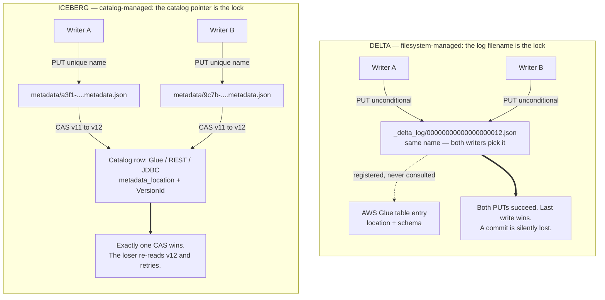
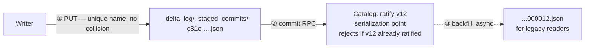

# Where Commit Authority Lives

Why AWS Glue can serialize Iceberg commits but not Delta ones, why S3's missing put-if-absent was a Delta problem and never an Iceberg one, and what changes when the catalog becomes Delta's source of truth.

> **Reading time** ~12 minutes.
>
> **Reviewed against** Delta 4.1–4.3, Unity Catalog OSS 0.4, Apache Polaris 1.x, and AWS Glue as of September 2026.

---

## Contents

1. [The one-sentence answer](#1-the-one-sentence-answer)
2. [The mechanism](#2-the-mechanism)
3. [Glue as a Delta catalog vs. an Iceberg catalog](#3-glue-as-a-delta-catalog-vs-an-iceberg-catalog)
4. [Two things changed](#4-two-things-changed)
5. [The Delta 4.1 option: the catalog as Delta's source of truth](#5-the-delta-41-option-the-catalog-as-deltas-source-of-truth)

---

## 1. The one-sentence answer

**Iceberg puts its atomicity in the catalog; classic Delta puts its atomicity in the object store's filename space.** Glue happens to expose exactly the primitive Iceberg needs — a compare-and-swap on a table row — and Delta's original protocol has no place to call it from, so Glue is never on the commit path at all. That is the whole of it. Everything below is the elaboration.

> **The corollary teams discover the hard way:** because Delta's commit is "create the file named `…000012.json`, and fail if it exists," it inherits the storage layer's concurrency guarantees directly. S3 historically had none, so you had to build the mutual exclusion yourself. Iceberg never asks the storage layer for anything but a durable write to a name nobody else will pick.

---

## 2. The mechanism



### Why the numbered filename is the crux

A Delta table's current version is not recorded anywhere. It is *derived* — a reader lists `_delta_log/` and takes the highest contiguous version number it finds. That design is what makes Delta catalog-free and portable, and it is also what makes the filename the only serialization point. Two writers that both read version 11 will both compute "my commit is 12," both render a file named `…000012.json`, and both try to create it. Correctness requires that exactly one of those creates succeeds, which is precisely `putIfAbsent`.

HDFS gave it (atomic rename). Azure ADLS Gen2 gave it. GCS gave it (`x-goog-if-generation-match: 0`). S3, until late 2024, did not: `PUT` was unconditional and last-writer-wins. Hence the two OSS escape hatches:

- `S3SingleDriverLogStore` — correct only when every writer shares one JVM.
- `S3DynamoDBLogStore` — borrows DynamoDB's conditional write as the mutual-exclusion service, writes a temp object and copies it into the canonical name, with recovery logic to finish commits whose writer died mid-flight.

Custom commit coordinators built in-house are a third instance of the same pattern.

Iceberg sidesteps the problem by construction. Every metadata file is written under a name containing a fresh UUID, so no two writers ever contend for a name. The table's identity is a *single pointer* — "this table's current metadata is at *path*" — and that pointer lives in the catalog. Committing means asking the catalog to swap the pointer from the value you read to the value you produced, conditionally. Every Iceberg catalog implements that swap with whatever transactional primitive it has: Glue's `UpdateTable` with an optimistic-locking `VersionId`, Hive Metastore's RDBMS row lock, a JDBC transaction, Nessie's git-style CAS, or a REST catalog's server-side check.

```python
# Iceberg on Glue — the CAS, as the client actually performs it

# 1. read current pointer + the version token
t   = glue.get_table(DatabaseName="finance", Name="orders")["Table"]
cur = t["Parameters"]["metadata_location"]
ver = t["VersionId"]

# 2. write new metadata to a UUID-derived name — no contention possible
new_loc = f"{base}/metadata/00043-{uuid4()}.metadata.json"
s3.put_object(Bucket=..., Key=..., Body=serialize(new_metadata))

# 3. compare-and-swap. This single call IS Iceberg's concurrency control.
glue.update_table(
    DatabaseName="finance",
    TableInput={"Name": "orders", "Parameters": {
        "metadata_location":          new_loc,
        "previous_metadata_location": cur}},
    VersionId=ver)
# a concurrent writer bumped VersionId -> ConcurrentModificationException
#   -> refresh from v12, re-apply, retry
```

```properties
# Delta, filesystem-managed — note that Glue appears nowhere in the configuration
spark.delta.logStore.s3a.impl                            io.delta.storage.S3DynamoDBLogStore
spark.io.delta.storage.S3DynamoDBLogStore.ddb.tableName  delta_log_mutex
spark.io.delta.storage.S3DynamoDBLogStore.ddb.region     us-east-1

# The mutual exclusion is DynamoDB's conditional write, not Glue's.
# Glue holds a location and a schema copy that nothing verifies.
```

---

## 3. Glue as a Delta catalog vs. an Iceberg catalog

| | Glue + Iceberg | Glue + Delta (classic) |
|---|---|---|
| | **A real catalog.** | **A directory listing.** |
| What Glue holds | `metadata_location` + `VersionId` | a name, a location, a stale schema copy |
| On the commit path? | Yes — table state cannot advance without Glue's CAS | **Never called** |
| Drop Glue and… | the table is unusable | the table keeps working fine |
| Concurrency | Glue's problem, solved | the storage layer's problem, unsolved |
| Engine reach | any IRC-speaking engine participates in the same concurrency control | engines read the files despite Glue, not through it |

This is also why the failure modes differ so sharply. A missing lock on Iceberg produces a rejected commit and a retry. A missing lock on Delta-on-S3 produces a *successful* commit that overwrites another successful commit — silent data loss discovered later, during a reconciliation, not at write time.

---

## 4. Two things changed

Both of the reasons teams built custom coordinators have been addressed upstream. Worth an explicit evaluation before carrying that code forward another year.

| | |
|---|---|
| **Change 1 · Nov 2024**<br>S3 conditional writes | S3 now honours `If-None-Match: *` on `PutObject` and `CompleteMultipartUpload`. That is put-if-absent, natively. The storage-layer gap that forced DynamoDB into existence closed; what remains is whether every writer in your fleet runs a client version that uses it. |
| **Change 2 · Delta 4.1+**<br>Catalog-managed tables | Delta's protocol now has a commit-coordinator seat, gated by the `delta.feature.catalogManaged` table property. Writers stage a UUID-named commit under `_delta_log/_staged_commits/` and ask the catalog to ratify it; the catalog serializes. Iceberg's model, retrofitted onto Delta. |



Because step ① writes to a name derived from a UUID rather than from the version number, an unconditional S3 `PUT` is sufficient — the ordering decision has moved entirely into step ②.

### Why the S3 gap was never a problem under Unity Catalog

**Because under Unity Catalog the object store is not the thing being asked to arbitrate.** Databricks solved this internally years before the protocol change, by routing every Delta commit through a managed commit service; catalog-managed tables are that mechanism standardized into the open Delta protocol, and Unity Catalog OSS 0.4 was the first open implementation. Once the catalog ratifies, the object store's only job is to durably hold bytes at a name nobody contends for — a job S3 always did correctly.

> **Practical read.** If your fleet is on Delta 4.1+ and an S3-conditional-write-capable client, a custom coordinator is redundant twice over. If parts of the fleet are pinned to older runtimes, it is still load-bearing for those — but it is now a compatibility shim with a defined end date, not permanent architecture. That reframing is worth making explicit to whoever maintains it.

---

## 5. The Delta 4.1 option: the catalog as Delta's source of truth

Worth stating as a first-class option rather than a footnote, because it is new enough that most architecture discussions predate it. Until Delta 4.1, "use Delta" and "let the catalog coordinate" were mutually exclusive — the protocol had nowhere to put a coordinator. That is no longer true.

The switch is a table feature, not a migration:

```sql
ALTER TABLE finance.orders
  SET TBLPROPERTIES ('delta.feature.catalogManaged' = 'supported');

-- The data files do not move. The existing _delta_log is not rewritten.
-- What changes is where the *next* commit's ordering decision is made.
```

### What actually changes

| | Filesystem-managed (classic) | Catalog-managed (4.1+) |
|---|---|---|
| **Source of truth for the current version** | a listing of `_delta_log/`. Derived, never recorded. | the catalog. Recorded, and authoritative. |
| **What storage must provide** | atomic create-if-absent on a name two writers will both pick. | a durable write to a UUID-derived name. Nothing else. |
| **Conflict detection** | client-side, after the fact, if the storage layer cooperates. | server-side. The catalog validates and rejects malformed or conflicting commits before they are visible. |
| **Metadata read path** | list the log directory, replay checkpoints. Latency scales with history. | the catalog returns table metadata directly — no filesystem round trip to resolve a table. |
| **Multi-table atomicity** | impossible in principle. | available, because one party now orders commits to both tables. |
| **Legacy readers** | — | still served: ratified commits are published back to canonical `…NNNN.json` names asynchronously. |

### The honest trade

This is the same bargain Iceberg made in 2017, arriving in Delta nine years later — and it carries the same cost. A filesystem-managed Delta table is readable by anything that can list a prefix, which is why Delta spread as fast as it did. A catalog-managed table is not: **you have made the catalog a hard runtime dependency of every read and write.** That is a real trade, not a free upgrade, and it is worth naming explicitly rather than discovering during an incident.

Three preconditions before this is actionable:

- **A Delta 4.1+ floor across every writer.** A writer on an older runtime does not understand the table feature and must be blocked from the table, not merely discouraged. This is the constraint that usually sets the timeline.
- **A catalog that implements the Delta commit APIs.** Today that means Unity Catalog — OSS 0.4.0 was the first open implementation, and Delta 4.3 hardened the contract. The protocol is open; the field of implementations is not yet crowded.
- **An operational answer for catalog availability.** Commits now fail when the catalog is unreachable. On a managed service this is someone else's SLA; on a self-hosted one it is yours, and it is a tighter requirement than the catalog previously had to meet.

> **Where this leaves a custom coordinator.** There are now two independent ways to retire it: S3 conditional writes, which fix the storage primitive and leave the architecture alone, and catalog-managed tables, which change the architecture. The first is a version bump and should happen regardless. The second is a platform decision and is worth taking on its own merits — server-side validation, multi-table transactions and catalog-served metadata — rather than as a workaround for a gap that S3 has already closed.

---

## Sources

- [Delta catalog-managed tables](https://delta.io/blog/2026-02-02-delta-catalog-managed-tables/)
- [Delta 4.3 and the Unity Catalog Delta APIs](https://delta.io/blog/2026-06-22-delta-4-3-release/)
- [S3 conditional writes](https://docs.aws.amazon.com/AmazonS3/latest/userguide/conditional-writes.html)
- [Multi-cluster writes to Delta Lake on S3](https://delta.io/blog/2022-05-18-multi-cluster-writes-to-delta-lake-storage-in-s3/)
- [Connecting to the Glue Data Catalog with the Iceberg REST endpoint](https://docs.aws.amazon.com/glue/latest/dg/connect-glu-iceberg-rest.html)
- [Databricks catalog commits](https://docs.databricks.com/aws/en/delta/catalog-commits)
